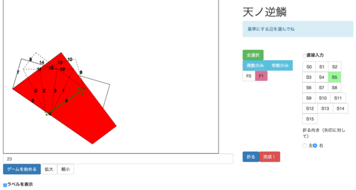

Team 天羽々斬 (Ame no Habakiri)
===============================

天羽々斬 is the sword that killed ヤマタノオロチ (Yamata no Orochi, The
Eight-headed Dragon) in Japanese mythology. You can see it in Kojiki as well as
Origami (!).

## Members
- Osamu Koga ([osa_k](https://twitter.com/osa_k)) -- Infrastructure, Web
  Frontends
- kawatea -- Main AI, UI solver, Hand solving
- Shunsuke Ohashi -- Same problem detector, AI Solvers
- yuf -- Visualizer, Problem preprocessor
- mkut -- Origami manipulation tools, Hand soving
- keitak -- Tools, Hand solving
- hyon -- Awesome Origami crafter, Hand solving
- carbon_twelve -- Survey on Origami theories, Hand solving

## Basic Strategy
*kawatea-convex* is a convex-based AI to fold origami. It places origami on
one of the edges then fold it on one of the skeletons so that the resulting
shape fits to _convex hull_ of the original silhouette. It was developed at
early time and supported us with constantly solving relatively easy problems.

From the second day, we focused on solving problems by hand. At first 
we started to fold origami with directly chose a folding line from console to
make a solution, which was taken over by a browser-based GUI afterwards.
As there are many identical problems submitted by competitiors, an AI named
*Grace* detects those duplicates with ignoring translation and rotation to
reuse the existing solution for them.

## Tools
Most tools are separated into logic parts and glues. This modularization works
well pariculary when core members are experienced competitive programmers --
Often they are amazingly good at writing complicated logics but not familiar
with higher layer APIs than pure logics, e.g. networking, Linux processes, etc.
We built tools in the way that front / aggregation tools communicated with
backend logics via stdin / stdout using glue scripts.

### [レイシス](./rasis/rasis_say.py) (Rasis)
Command to post messages on team Slack.

### [Vis](./vis)
Simple visualizer. Converts a problem / solution file into JavaScript fragment
then renders on browser.

### [foolish](./keitak/foolish)
The first AI. Just folds origami exactly once to fit it into silhouette.

### [kawatea-convex](./kawatea/convex3.cpp)
The second and our main AI. Computes a convex hull of the given problem and
fold origami to fit against it.

### [逆羅刹](./gyakurasetsu) (Gyaku rasetsu)
Problem manager. Provides our own UI to run AI and submit its outputs to track
our submission status. Also it shows global situation like which problems are
solved by only few teams, which means a potential score source if we could solve
them.

### [グレイス](./grace) (Grace)
As many teams submitted the same problem to, or just parallel translated or
rotated variation of ones in Kojiki, this tool detects those resemblant problems
to reuse the existing solution. 

### [天ノ逆鱗](./gekirin) (Ame no Gekirin)

UI for hand-solvers. Users can fold facets of origami by arbitrary line to craft
solutions. Originally it was console UI developed by @kawatea
([kawatea/hand.cpp](./kawatea/hand.cpp)) but was ported into backend ([kawatea/ui_helper.cpp](./kawatea/ui_helper.cpp))
to support interactive browser-based frontend.

### [Gideon](./mkut/gideon)
Command line tools to manipulate origami. It reads origami specification from
solution file then produce another solution after applies a speficied operation.
Translation, rotation and fold are supported.

### [天空の夜明け](./yuf/tenkuunoyoake) (Tenku no Yoake)
Unfold a problem once to obtain a convex silhouette, which means the convex AI
can provide the exact solution (note that the AI does not care about skeletons
which are not a part of silhouette.) Once the solution for "simplified" problem
is obtained, we can generate the solution for original problem by folding it
with Gideon. It solved ~100 elementary problems.

### [つまぶき](./tsumabuki) (Tsumabuki)
Specialized solver for team yowa's problem. After visual inspection we noticed
that their problems were constructed in a quite paraticular method and deeper
insight gave us an greedy algorithm to solve them. With few attempts with debug
this tool achived to solve all problems by that team.
